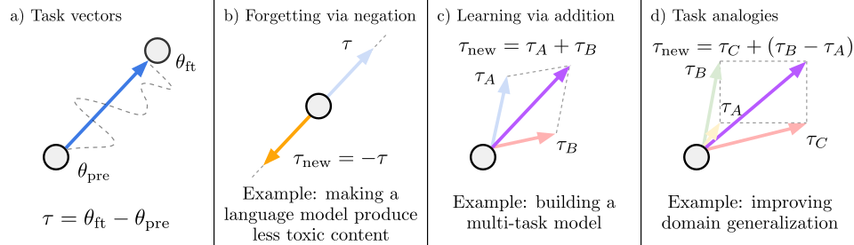

# Editing Models with Task Arithmetic

This repository contains code for the ICLR 2023 paper [Editing Models with Task Arithmetic](https://arxiv.org/abs/2212.04089), by Gabriel Ilharco, Marco Tulio Ribeiro, Mitchell Wortsman, Suchin Gururangan, Ludwig Schmidt, Hannaneh Hajishirzi and Ali Farhadi.

### Abstract
*Changing how pre-trained models behave---e.g., improving their performance on a downstream task or mitigating biases learned during pre-training---is a common practice when developing machine learning systems. In this work, we propose a new paradigm for steering the behavior of neural networks, centered around task vectors. A task vector specifies a direction in the weight space of a pre-trained model, such that movement in that direction improves performance on the task. We build task vectors by subtracting the weights of a pre-trained model from the weights of the same model after fine-tuning on a task. We show that these task vectors can be modified and combined together through arithmetic operations such as negation and addition, and the behavior of the resulting model is steered accordingly. Negating a task vector decreases performance on the target task, with little change in model behavior on control tasks. Moreover, adding task vectors together can improve performance on multiple tasks at once. Finally, when tasks are linked by an analogy relationship of the form ``A is to B as C is to D", combining task vectors from three of the tasks can improve performance on the fourth, even when no data from the fourth task is used for training. Overall, our experiments with several models, modalities and tasks show that task arithmetic is a simple, efficient and effective way of editing models.*


### Summary figure

<p align="center">

</p>

An illustration of task vectors and the arithmetic operations we study for editing models. (a) A task vector is obtained by subtracting the weights of a pre-trained model from the weights of the same model after fine-tuning. (b) Negating a task vector degrades performance on the task, without substantial changes in control tasks. (c) Adding task vectors together improves the performance of the pre-trained model on the tasks under consideration. (d) When tasks form an analogy relationship such as supervised and unsupervised learning on two different data sources, it is possible to improve performance on a supervised target task using only vectors from the remaining three combinations of objectives and datasets.

## Code

### Install dependencies

```bash
conda env create
conda activate task-vectors
```


### Add directory to PYTHONPATH:

```bash
cd task_vectors
export PYTHONPATH="$PYTHONPATH:$PWD"
```

### Using task vectors

The task vector logic can be found at [src/task_vectors.py](src/task_vectors.py).

To create a task vector, you will need a pre-trained checkpoint and a fine-tuned checkpoint:

```python
from task_vectors import TaskVector
task_vector = TaskVector(pretrained_checkpoint, finetuned_checkpoint)
```

Once created, task vectors can be modified and combined through arithmetic operations! For instance, to negate a task vector, simply use the ```-``` operator:

```python
# Negating a task vector
new_task_vector = -task_vector
```

To add task vectors, you can use the ```+``` operator, or ```sum```:

```python
# Adding two task vectors
new_task_vector = task_vector_A + task_vector_B
# Adding multiple task vectors
new_task_vector = sum(list_of_task_vectors)
```

Analogies can be done as simply as:

```python
# Task analogies
new_task_vector = task_vector_C + task_vector_B - task_vector_A
```

### Checkpoints

Checkpoints for CLIP ViT-B/32, ViT-B/16 and ViT-L/14 are available on he link below, including fine-tuned checkpoints on eight downstream tasks: Stanford Cars, DTD, EuroSAT, GTSRB, MNIST, RESISC45, SUN397 and SVHN.

[Download here](https://drive.google.com/drive/folders/1u_Tva6x0p6oxu5Eo0ZZsf-520Cc_3MKw?usp=share_link)

### Examples

Below is an example of negating a task vector from MNIST, then evaluating on MNIST and on ImageNet:

```python
import torch
from task_vectors import TaskVector
from eval import eval_single_dataset
from args import parse_arguments

# Config
dataset = 'MNIST'
model = 'ViT-L-14'
args = parse_arguments()
args.data_location = '/path/to/data'
args.model = model
args.save = f'checkpoints/{model}'
pretrained_checkpoint = f'checkpoints/{model}/zeroshot.pt'
finetuned_checkpoint = f'checkpoints/{model}/{dataset}/finetuned.pt'


# Create the task vector
task_vector = TaskVector(pretrained_checkpoint, finetuned_checkpoint)
# Negate the task vector
neg_task_vector = -task_vector
# Apply the task vector
image_encoder = neg_task_vector.apply_to(pretrained_checkpoint, scaling_coef=0.5)
# Evaluate
eval_single_dataset(image_encoder, dataset, args)
eval_single_dataset(image_encoder, 'ImageNet', args)
```

You can also find an example of adding task vectors together below, using the MNIST and RESISC45 datasets:


```python
import torch
from task_vectors import TaskVector
from eval import eval_single_dataset
from args import parse_arguments

# Config
datasets = ['MNIST', 'RESISC45']
model = 'ViT-L-14'
args = parse_arguments()
args.data_location = '/path/to/data'
args.model = model
args.save = f'checkpoints/{model}'
pretrained_checkpoint = f'checkpoints/{model}/zeroshot.pt'

# Create the task vectors
task_vectors = [
    TaskVector(pretrained_checkpoint, f'checkpoints/{model}/{dataset}/finetuned.pt')
    for dataset in datasets
]
# Sum the task vectors
task_vector_sum = sum(task_vectors)
# Apply the resulting task vector
image_encoder = task_vector_sum.apply_to(pretrained_checkpoint, scaling_coef=0.8)
# Evaluate
for dataset in datasets:
    eval_single_dataset(image_encoder, dataset, args)
```
